Language Standard


All source code, documentation, database objects, identifiers and user interface resources shall use American English.


Exceptions:


Legal names.

User-entered data.

Quotations.

Localized UI translations.


Documentation diagrams shall be authored in Mermaid whenever practical.


ASCII diagrams may be used during drafting or for simple conceptual illustrations. Image-based diagrams should be reserved for cases where Mermaid cannot adequately express the required information.


1\. Direction


Unless there's a good reason otherwise:


Top-to-bottom (TD) for workflows, hierarchies, and processes.

Left-to-right (LR) for layered architectures or pipelines.


2\. Node naming


we'll use meaningful identifiers:


Organization --> Company

Company --> Employment

Employment --> Person


3\. Entity Relationship Diagrams


When documenting data relationships, we'll use Mermaid's ER syntax:

```mermaid

erDiagram


&#x20;   ORGANIZATION ||--o{ COMPANY : owns

&#x20;   COMPANY ||--o{ EMPLOYMENT : employs

&#x20;   PERSON ||--o{ EMPLOYMENT : works\_as

```

4\. Flowcharts


For business processes or architectural flows:


```mermaid

flowchart TD


&#x20;   Organization --> Company

&#x20;   Organization --> BusinessProcess


&#x20;   Company --> Employment

&#x20;   Employment --> Person


&#x20;   BusinessProcess --> Assignment

```

5\. Sequence diagrams


When we reach integrations or APIs, we'll use sequence diagrams.

```mermaid

sequenceDiagram



&#x20;   User->>Orion: Upload bank statement

&#x20;   Orion->>Pipeline: Validate file

&#x20;   Pipeline->>Database: Import transactions

&#x20;   Database-->>Pipeline: Success

&#x20;   Pipeline-->>User: Import completed

```




