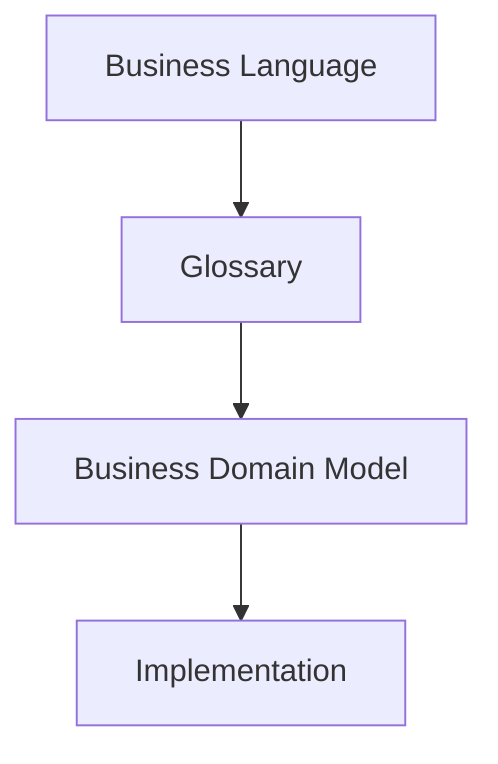
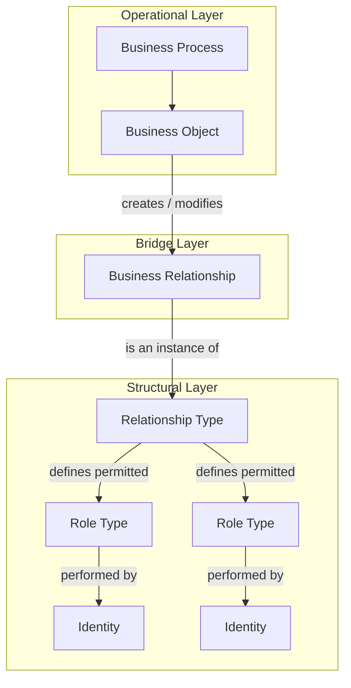
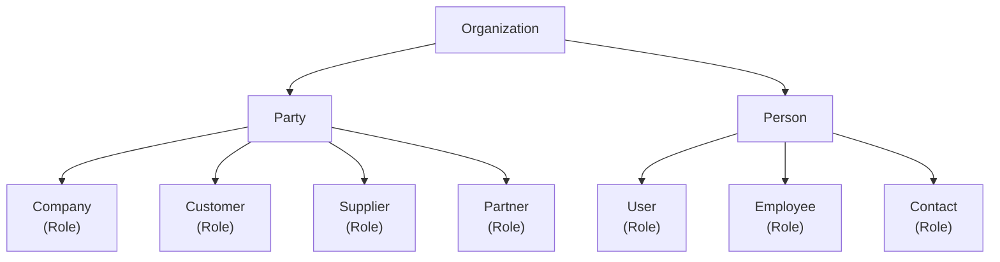

# ARCH-03 — Business Domain Model

| Property | Value |
|----------|-------|
| Document ID | ARCH-03 |
| Title | Domain Model |
| Status | Approved |
| Version | 1.1 |
| Owner | Orion Project |
| Last Updated | 2026-07-22 |
| Depends On | ARCH-00 |
| Related ADRs | None |

---

# 1. Purpose and Scope

The **Orion Business Domain** Model defines the business concepts that make up the Orion platform and the relationships between them.

It provides a technology-independent representation of the business and serves as the foundation for the application's architecture, database design, user interface and APIs.

The Business Domain Model describes **what the business is**, not **how it is implemented**.

**Business Domain Model** serves as the authoritative conceptual modeling guide for Orion. All new domain concepts shall conform to the taxonomy, conceptual questions and validation principles defined in this document before implementation begins.

Orion follows a concept-first design process.



Business concepts are defined in the **Glossary**, organized in the **Business Domain Model**, and only then translated into software implementation.

The conceptual domain model describes business concepts independently of implementation. A single implementation artifact (for example, a Django model) may represent one or more conceptual elements where doing so simplifies the implementation without compromising the conceptual integrity of the model.

The conceptual domain model represents business concepts independently of the legal or technical mechanisms through which they are realized. Conceptual Business Objects describe the information required to manage the business, not necessarily the legal form in which that information exists.

---

# 2. Business Architecture

# 2.1. Overview

The Business Architecture defines the stable concepts used throughout Orion. Module-specific specifications extend this architecture but shall not contradict it.

Orion models a business through a layered architecture. Operational concepts describe how work is performed, structural concepts describe stable business identities and relationships, while Business Relationships connect both layers.

## 2.2. Architecture Layers

The domain taxonomy make a distinction between categories that belong to the **Business Structure** and **Business Operation**:

```
├── Operational Layer
│     ├── Business Process
│     └── Business Object
│
├── Bridge Layer
│     └── Business Relationship
│
└── Structural Layer
      ├── Relationship Type
      ├── Role Type
      └── Identity
```
## 2.3. Conceptual Diagram


---

# 3. Core Concepts

## 3.1. Identity

The Identity model defines the fundamental business identities recognised by Orion and the relationships between them.

An **Identity** represents something that exists independently and has its own lifecycle.

An Identity remains the same even if the roles it performs, the relationships it participates in, or the business activities it undertakes change over time.

An Identity is independent of business processes. Roles, business relationships and business objects reference identities rather than defining them.

**Examples:**

- Organization
- Party
- Person
- Identity Relationship

``` text
Identity
├── Organization
├── Party
├── Person
└── Identity Relationships
      ├── Embodiment
      └── Representation
```
---

## 3.2. Role Type

A predefined Orion classification describing the function performed by an Identity within a particular Relationship Type.

A Role defines the business capabilities available to an Identity and contains only business data specific to that participation.

Roles do not exist independently from the Identity that performs them.

Roles have no independent existence outside a Business Relationship.

A single Identity may perform multiple different roles simultaneously. Each Identity may perform each role at most once.


**Examples:**

- Company
- Customer
- Supplier
- Partner
- Employee
- User

---

## 3.3. Relationship Type

A predefined Orion classification defining the permitted participant Identity types and the Roles they may perform.

---

## 3.4. Business Relationship

A business fact connecting Identities according to a predefined Relationship Type.

Each participant performs exactly one Role within that relationship.

Relationships describe how participants are associated within the business independently of the documents or transactions that may formalize or result from those associations. Relationships have their own lifecycle and business rules but exist only because the connected concepts exist.

**Examples:**

- Employment
- Customer Relationship
- Supplier Relationship
- Ownership

---

## 3.5. Business Process

An organization-defined operational classification describing the business activity within which Business Objects are used. Business Processes provide operational context and reporting dimensions but do not determine business semantics.

**Examples:**

- Customer Acquisition
- Sales
- Procurement
- Payroll

---

## 3.6. Business Object

A predefined Orion concept representing a business document or transaction that creates or modifies Business Relationships.

A **Business Object** represents information that the Organization creates, manages or records as part of its business activities.

Unlike Identities and Roles, Business Objects are transactional in nature and normally have a defined lifecycle consisting of creation, modification and completion.

Every Business Object have:

- zero or one primary Business Process, and
- zero or one primary Business Relationship.

**Examples:**

- Employment Agreement
- Customer Agreement
- Assignment
- Invoice
- Payment
- Journal Entry
- Time Entry

---


## Examples

**Employment**
```
Business Process
    Human Resources

Bosiness Object
    Employment Agreement

Business Relationship
    Employment

Participants:

ABC Ltd
    Role Type: Employer
    Identity: Party

John Smith
    Role Type: Employee
    Identity: Person
```


# 4. Identity Architecture

## 4.1. Overview

The Identity Architecture defines the stable business participants recognised by Orion and the relationships between them. These identities form the foundation upon which Business Relationships, Roles and Business Objects operate.




## 4.2. Organization

### Purpose

Organization is the root business concept within Orion.

The Organization establishes the highest boundary for ownership, security, configuration and management reporting. All business concepts managed by Orion belong to exactly one Organization, and shall not be shared across Organizations.

### Definition

An **Organization** represents the business as a whole.

It defines the scope within which all business identities, business processes and business objects exist.

An Organization is not necessarily a legal entity.

### Characteristics:
- Exactly one Organization exists within an Orion installation.
- An Organization owns Parties and Persons.
- The Organization exists for the lifetime of the installation.
- The Organization name may be changed, but the Organization itself cannot be replaced or deleted.

---

## 4.3. Party

### Purpose

A Party is the business identity through which Orion interacts with other business subjects.

### Definition

A **Party** represents an identifiable business identity participating in, or interacting with, business activities of the Organization. A Party may be a legal entity, an individual acting in a business capacity, or another type of organization with which the Organization interacts (such as a government authority, financial institution, or non-profit organization).

A Party exists independently of the roles it performs and provides a stable identity throughout its lifecycle.

The Party concept allows Orion to represent business participants without duplicating identity information when a participant performs multiple business roles.

### Design Evolution

During the design of Orion, Company was initially modeled as a core business identity.

Following further analysis, it became clear that Company represents a business role performed by a Party rather than an independent identity. This change simplified the domain model and established the principle that stable identities are modeled independently from the roles they perform.

---

## 4.4.Person

### Purpose

A Person is the business identity through which Orion interacts with individuals.

### Definition

A **Person** represents an individual known to Orion.

A Person is structurally independent of any particular Party and may be associated with one or more Parties through Identity Relationships.

A Person represents the individual, whereas a Party represents the business identity through which that individual participates in business.

Examples include:
- employees;
- sole traders;
- company directors;
- accountants;
- customer contacts;
- supplier representatives.

A Person may exist even when not currently associated with any Party.

---

## 4.5. Identity Relationships

### Purpose

Identity Relationships define structural associations between identities independently of any business process.

### Embodiment

Embodiment associates a **Party** of type *Individual* with the **Person** whom it represents.

Characteristics:
- mandatory for Parties of type *Individual*;
- exactly one associated Person;
- immutable throughout the lifetime of the Party.

Example:
```text
Party (John Smith Trading)
        │
        └── embodies
                │
                ▼
          Person (John Smith)
```
### Association

Association associates a **Party** with one or more **Persons** with a specified function.

Examples include:
- Director
- Accountant
- Sales Contact
- Legal Representative

Characteristics:
- optional;
- many-to-many;
- time-dependent;
- historical.

```text
Party (ABC Ltd.)
        │
        ├── Director ─────► John Smith
        ├── Accountant ───► Mary Brown
        └── Contact ──────► Peter White
```
### Relationship to Business Relationships

Identity Relationships describe how identities are structurally associated.

Business Relationships describe commercial or organisational relationships between business participants.

The two concepts are independent and shall not be confused.


## 5. Relationship Matrix

This matrix shows how identities and their roles are related in the business context. This is illustrative and not to be considered conclusive.


<table>
  <thead>
    <tr>
        <th colspan="1">Identities</th>
        <th colspan="1"></th>
        <th colspan="1">Party</th>
        <th colspan="4">Person</th>            
    </tr>
        <th></th>
        <th>Role Types</th>
        <th>Company</th>
        <th>Employee</th>
        <th>Director</th>
        <th>Contact</th>
        <th>User</th>
    <tr>
        <th>Party</th>
        <th>Customer</th>
        <th>Sales Contract</th>
        <th>Responsible Person</th>
        <th>N/A</th>
        <th>Representative</th>
        <th>N/A</th>                          
    </tr>
    <tr>
        <th></th>
        <th>Supplier</th>
        <th>Supply Agreement</th>
        <th>Responsible Person</th>
        <th>N/A</th>
        <th>Representative</th>                        
        <th>N/A</th>    
    </tr>
    <tr>
        <th></th>
        <th>Partner</th>
        <th>Shareholder Relationship</th>
        <th>Responsible Person</th>
        <th>N/A</th>
        <th>Representative</th>                        
        <th>N/A</th>    
    </tr>
    <tr>
        <th></th>
        <th>Partner</th>
        <th>Loan Agreement</th>
        <th>Responsible Person</th>
        <th>N/A</th>
        <th>Representative</th>                        
        <th>N/A</th>    
    </tr>
    <tr>
        <th></th>
        <th>Company</th>
        <th>N/A</th>
        <th>Employment Agreement</th>
        <th>Corporate Governance Arrangement</th>
        <th>N/A</th>                        
        <th>Access Privileges</th>    
    </tr>
    <tr>
        <th>Organization</th>
        <th>Owner</th>
        <th>Ownership</th>
        <th>Ownership</th>
        <th>--</th>
        <th>--</th>                        
        <th>Access Privileges</th>    
    </tr>
  </thead>
  <tbody>

  </tbody>
</table>

---

# 6. Architectural Principles

## 6.1 Business Process Principles

### ARCH-003-P001

Business Processes define operational context.

### ARCH-003-P002

Every Business Process produces one or more outputs.

Outputs of Business Processes are represented by Business Objects created or modified by the process.

### ARCH-003-P003

Business Processes communicate exclusively through Business Objects.

Outputs produced by one Business Process may become inputs to other Business Processes.

### ARCH-003-P004

Business Processes may be organized hierarchically.

A Business Process may be decomposed into one or more Business Sub-processes.

Decomposition continues until the lowest-level Business Processes are reached.

Lowest-level Business Processes consist of Business Activities, representing indivisible units of work.

Business Activities are recorded by Business Objects.

### ARCH-003-P005

Business Processes are defined by the Organization.

Orion imposes no predefined catalogue of Business Processes.

## 6.2 Business Object Principles

### ARCH-003-P101

Business Objects define business semantics.

### ARCH-003-P102

Business Objects are predefined by Orion.

Organizations may configure their usage but shall not define new Business Object types.

### ARCH-003-P103

Each Root Business Object invariantly defines the Relationship Type within which it operates.

### ARCH-003-P104

A Business Process is an optional attribute of a Root Business Object.

If assigned, it provides the operational context for the Business Object hierarchy.

### ARCH-003-P105

Only Root Business Objects may be assigned a Business Process directly.

Child Business Objects inherit the Business Process from their parent.

### ARCH-003-P106

The classification of Business Objects according to their effect on Business Relationships is intentionally deferred until sufficient business scenarios have been modelled.

## 6.3 Relationship Principles

### ARCH-003-P201

Relationship Types are predefined by Orion.

### ARCH-003-P202

Role Types are predefined by Orion.

### ARCH-003-P203

Relationship Types define the permitted Roles.

### ARCH-003-P204

Role Types define the Identity types permitted to perform them.

### ARCH-003-P205

Business Relationships are instances of Relationship Types.

## 6.4 Identity Principles

### ARCH-003-P301

Identities represent stable business participants independent of their relationships.

### ARCH-003-P302

Business Relationships connect Identities without altering their identity.

### ARCH-003-P303

Roles describe functions performed by Identities within Business Relationships.

---

# 7. Related Documents


