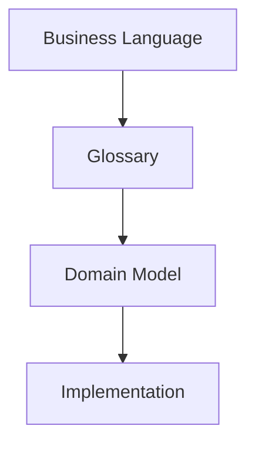
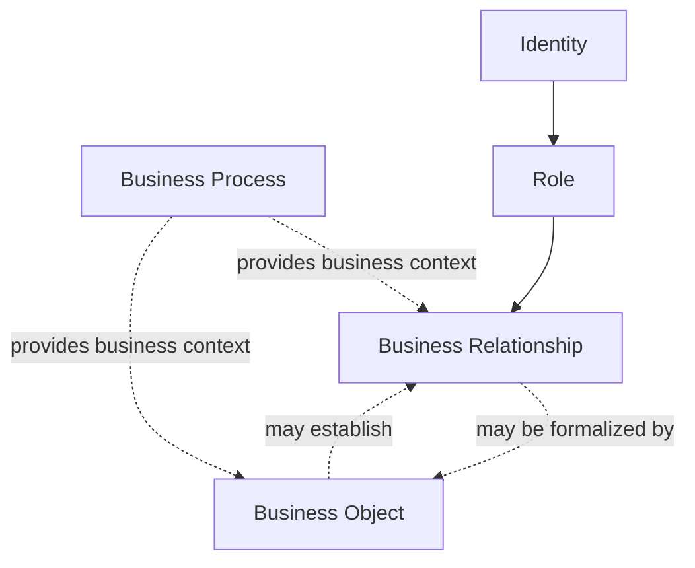
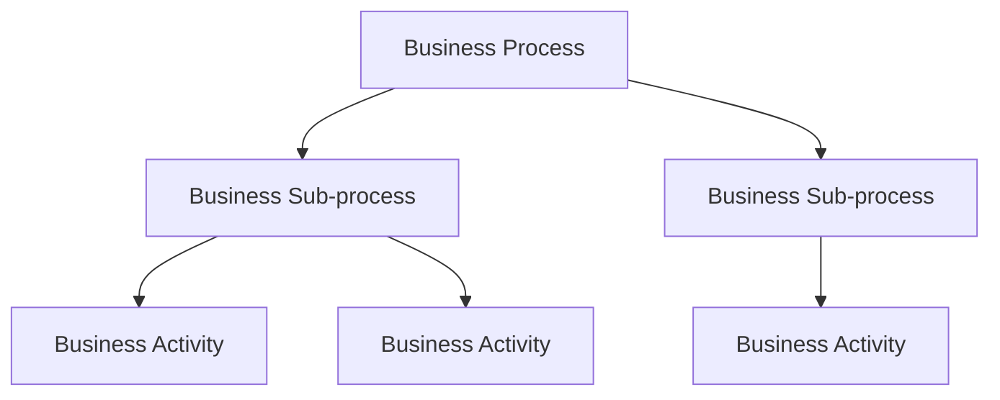
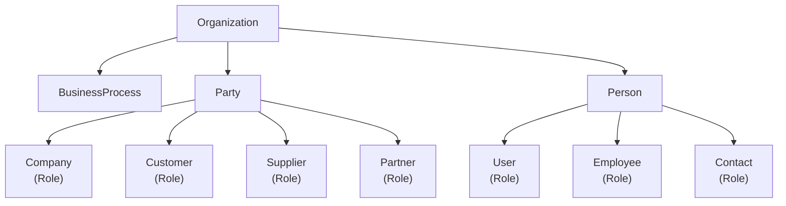

# ARCH-03 — Domain Model

| Property | Value |
|----------|-------|
| Document ID | ARCH-03 |
| Title | Domain Model |
| Status | Approved |
| Version | 1.0 |
| Owner | Orion Project |
| Last Updated | 2026-07-17 |
| Depends On | ARCH-00 |
| Related ADRs | None |

---

# Purpose

The Orion Domain Model defines the business concepts that make up the Orion platform and the relationships between them.

It provides a technology-independent representation of the business and serves as the foundation for the application's architecture, database design, user interface and APIs.

The Domain Model describes **what the business is**, not **how it is implemented**.

**ARCH-03** serves as the authoritative conceptual modeling guide for Orion. All new domain concepts shall conform to the taxonomy, conceptual questions and validation principles defined in this document before implementation begins.

---

# Conceptual Model

Orion follows a concept-first design process.

Business concepts are defined in the **Glossary**, organized in the **Domain Model**, and only then translated into software implementation.

The conceptual domain model describes business concepts independently of implementation. A single implementation artifact (for example, a Django model) may represent one or more conceptual elements where doing so simplifies the implementation without compromising the conceptual integrity of the model.

The conceptual domain model represents business concepts independently of the legal or technical mechanisms through which they are realized. Conceptual Business Objects describe the information required to manage the business, not necessarily the legal form in which that information exists.

---

# Domain Taxonomy

Orion models a business by distinguishing between identities, roles, business relationships, business processes and business objects.

Each category answers a different architectural question and has a distinct lifecycle.

Understanding these distinctions is essential for building a consistent, extensible and maintainable domain model.

## Conceptual Questions

Every concept in Orion should answer one primary conceptual question.

| Question | Category |
|----------|----------|
| What exists? | Identity |
| In what capacity does it participate? | Role |
| How are participants connected? | Business Relationship |
| What repeatable business outcome is being achieved? | Business Process |
| How is the activity managed or recorded? | Business Object |

When introducing a new concept, its primary responsibility should be identified before implementation begins.

---

## Business Structure and Business Activity

The domain taxonomy make a distinction between categories that belong to the **Business Structure** and **Business Activity**:

**Business Structure** says us how the business is organized:

- Business Process
- Identity
- Role
- Business Relationship

**Business Activity** says us what happens in the business:

- Business Objects

---

## Identity

An **Identity** represents something that exists independently and has its own lifecycle.

An Identity remains the same even if the roles it performs, the relationships it participates in, or the business activities it undertakes change over time.

**Examples:**

- Organization
- Party
- Person

---

## Role

A **Role** describes how an Identity participates in the business.

A Role defines the business capabilities available to an Identity and contains only business data specific to that participation.

Roles do not exist independently from the Identity that performs them.

A single Identity may perform multiple different roles simultaneously. Each Identity may perform each role at most once.

Business-specific variations of a role (such as different contracts, pricing agreements, payment terms or service arrangements) shall be represented by separate Business Objects rather than by creating additional instances of the same role.

**Examples:**

- Company
- Customer
- Supplier
- Partner
- Employee
- User

---

## Business Relationship

A **Business Relationship** is a business fact that connects two or more Identities or Roles.

Relationships describe how participants are associated within the business independently of the documents or transactions that may formalize or result from those associations. Relationships have their own lifecycle and business rules but exist only because the connected concepts exist.

Some relationships exist without dedicated business objects, while others are established or governed through business objects.

**Examples:**

- Employment
- Customer Relationship
- Supplier Relationship
- Ownership

---

## Business Process

A **Business Process** is a repeatable sequence of business activities performed to achieve a defined outcome.

Business Processes organize work; they do not own business entities.

**Examples:**

- Customer Acquisition
- Sales
- Procurement
- Payroll

## Business Object

A **Business Object** represents information that the Organization creates, manages or records as part of its business activities.

Business Objects may establish, govern, execute or record business activities and often formalize Business Relationships.

Unlike Identities and Roles, Business Objects are transactional in nature and normally have a defined lifecycle consisting of creation, modification and completion.

Every Business Object have:

- one primary Business Process, and
- zero or one primary Business Relationship.

**Examples:**

- Employment Agreement
- Customer Agreement
- Assignment
- Invoice
- Payment
- Journal Entry
- Time Entry

### Business Relationship and Business Object

Business Relationships and Business Objects represent different aspects of the business model.

A Business Relationship describes a business fact.

A Business Object represents the information through which that fact is established, managed or recorded.

A Business Relationship may exist independently of any Business Object.

For example, a prospective customer may have an established customer relationship before any quotation, agreement or invoice exists.

Conversely, some Business Objects establish or formalize Business Relationships.

For example:

- Employment Agreement establishes an employment relationship.
- Customer Agreement establishes a commercial relationship.
- Supplier Agreement establishes a procurement relationship.

Other Business Objects operate within existing relationships.

For example:

- Invoice
- Payment
- Assignment

Finally, some Business Objects merely record business events.

For example:

- Journal Entry
- Time Entry

### Categories of Business Objects

**Constitutive Business Objects** establish, modify or terminate Business Relationships. They record business events within establishing Business Relationships.

Examples:

- Employment Agreement
- Customer Agreement
- Supplier Agreement

**Operational Business Objects** record business events within, or without, establishing Business Relationships, but they do not establish, modify or terminate Business Relationships.

Examples:

- Invoice
- Payment
- Purchase Order
- Assignment
- Journal Entry
- Time Entry

---

# Business Process Architecture

Business Processes describe the behavioural structure of the Organization.

Where Identities, Roles and Business Relationships describe the static structure of the business, Business Processes describe how the business operates.

Business Processes provide the context in which Business Relationships are established and Business Objects are managed.

Business Processes communicate exclusively through Business Objects.

Outputs produced by one Business Process may become inputs to other Business Processes.

## Business Process Hierarchy

Business Processes may be organised hierarchically.

A Business Process may be decomposed into one or more Business Sub-processes.

Decomposition continues until the lowest-level Business Processes are reached.

Lowest-level Business Processes consist of Business Activities, which represent indivisible units of work within the process.

## Process Interfaces

Every Business Process produces one or more outputs.

Outputs are represented by Business Objects created or modified by the process.

These outputs may become inputs to other Business Processes.

Business Processes communicate through Business Objects rather than by direct dependency.

# Validation Matrix

A **Business Object** should be able to answer the following questions:

1. Which ***Business Process*** does it belong to? What business outcome does it help achieve? (inherited from the Business Process)
2. Which ***Business Relationship*** does it support or formalize (if any)?
3. Which ***Roles*** participate?
4. Which ***Identities*** perform those Roles?
5. Which ***Business Process*** it is produced by?
6. Which ***Business Process***, or an external process, it is consumed by?

| Business Object      | Business Process | Business Relationship | Roles    | Identities | Produced By | Consumed By |
| -------------------- | ---------------- | --------------------- | -------- | ---------- | ----------- | ----------- |
| *(To be identified)* | Required         | Optional              | Required | Required   | Required    | Required    |

Every new Business Object should be validated against this matrix before implementation. 

**Validation rules**:

- Every Business Object shall belong to one primary Business Process.
- A Business Object may establish, govern, operate within or record a Business Relationship.
- Every participating Role shall be performed by an Identity.
- Every Business Object shall belong to exactly one primary Business Process. Business Processes define the business context.
- A Business Object may establish, govern, operate within or record a Business Relationship.
- Business Objects manage or record the business activity.

Business Objects shall not duplicate information that belongs to Identities, Roles, Business Relationships or Business Processes. They shall reference those concepts and record only information specific to the business activity they manage.

---

# Identity Model

## Design Evolution

During the design of Orion, Company was initially modeled as a core business identity.

Following further analysis, it became clear that Company represents a business role performed by a Party rather than an independent identity. This change simplified the domain model and established the principle that stable identities are modeled independently from the roles they perform.

This principle now underpins the entire Orion domain model.

---

## Organization

### Concept Summary

| Property | Value |
|----------|-------|
| Scope | Global |
| Owned By | None |
| Owns | Party, Person, Business Process |
| Lifecycle | Infinite |
| Primary Module | Core |

### Definition

An Organization represents the highest-level operational boundary within Orion.

It models a business group operating as a single economic subject. An Organization defines the scope within which business data, users, business processes and reporting are managed.

An Organization is not necessarily a legal entity.

### Purpose

The Organization establishes the highest boundary for ownership, security, configuration and management reporting. All business concepts managed by Orion belong to exactly one Organization.

### Responsibilities

* Defines the operational boundary.
* Owns Parties.
* Owns Persons.
* Owns business processes.
* Defines management reporting boundaries.
* Defines security boundaries.
* Provides the context in which all business activities take place.

### Relationships

**Owns:**

* Party
* Person
* Business Process

**References:**

- Users
- Reference Data

**Referenced by:**

* Assignments
* Reporting
* Finance

### Business Rules

**ORG-001**

Every Party belongs to exactly one Organization.

**ORG-002**

Every Person belongs to exactly one Organization.

**ORG-003**

Every Business Process belongs to exactly one Organization.

**ORG-004**

Organization-level master data is available throughout the Organization.

**ORG-005**

Organizations are completely isolated from one another. Business data shall never be shared directly between Organizations.

### Examples

* Orion Consulting Group
* ABC Engineering Group

### Implementation Notes

Organization is the root business concept within Orion.

It defines ownership, security, configuration and reporting boundaries.

Business concepts owned by an Organization shall not be shared across Organizations.

Organization should remain stable throughout the lifetime of the business.

---

## Party

### Concept Summary

| Property | Value |
|----------|-------|
| Scope | Organization |
| Owned By | Organization |
| Owns | Role-specific business data |
| Lifecycle | Long-lived |
| Primary Module | Core |

### Definition

A Party represents an identifiable business identity within an Organization. A Party may be a legal entity, an individual acting in a business capacity, or another type of organization with which the Organization interacts (such as a government authority, financial institution, or non-profit organization).

A Party exists independently of the roles it performs and provides a stable identity throughout its lifecycle.

The Party concept allows Orion to represent business participants without duplicating identity information when a participant performs multiple business roles.

### Responsibilities

* Maintains the identity of a business participant.
* Serves as the owner of role-specific business information.
* Supports multiple simultaneous business roles.
* Provides a stable reference for business relationships.

### Relationships

**Belongs to:**

Organization

**Owns:**

* Company Role
* Customer Role
* Supplier Role
* Partner Role

**Referenced by:**

* Contracts
* Documents
* Assignments
* Financial Transactions

### Business Rules

**PTY-001**

Every Party belongs to exactly one Organization.

**PTY-002**

A Party may perform zero or more business roles.

**PTY-003**

A Party shall have only one identity within an Organization.

**PTY-004**

Business roles may be added or removed without affecting the identity of the Party.

### Examples

* Orion Consulting Ltd.
* Orion Services LLC.
* First National Bank
* Ministry of Finance
* John Doe (independent consultant)

### Implementation Notes

Party represents business identity rather than business behavior.

Role-specific data should belong to the corresponding business role rather than to the Party itself.

The Party concept shall remain independent of individual business modules to ensure extensibility.

## Concept Modeling Procedure

Every new domain concept should be introduced using the following procedure:

1. Identify the business problem the concept solves.
2. Determine the primary conceptual question it answers.
3. Classify the concept using the domain taxonomy.
4. Define its responsibilities and lifecycle.
5. Identify its dependencies on existing concepts.
6. Verify that it does not duplicate existing responsibilities.
7. Validate the concept against the Business Object Validation matrix where applicable.
8. Only then proceed to implementation.

