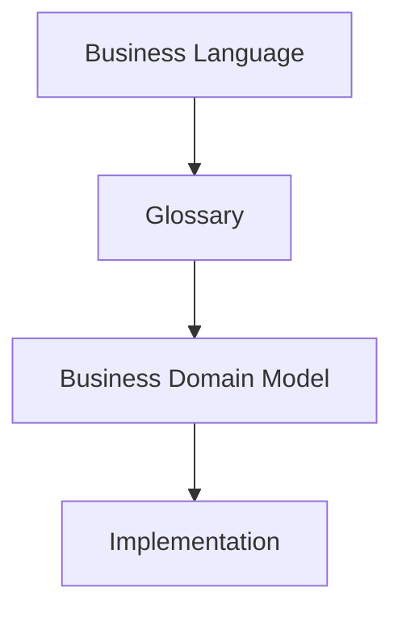

# Business Domain Model

| Property | Value |
|----------|-------|
| Document ID | ARCH-03 |
| Title | Domain Model |
| Status | Approved |
| Version | 2.1 |
| Owner | Orion Project |
| Last Updated | 2026-08-05 |
| Depends On | ARCH-000 |
| Related ADRs | None |

---

# 1. Purpose and Scope

The **Orion Business Domain** Model defines the business concepts that make up the Orion platform and the relationships between them.

It provides a technology-independent representation of the business and serves as the foundation for the application's architecture, database design, user interface and APIs.

The Business Domain Model describes **what the business is**, not **how it is implemented**.

**Business Domain Model** serves as the authoritative conceptual modeling guide for Orion. All new domain concepts shall conform to the taxonomy, conceptual questions and validation principles defined in this document before implementation begins.

Orion follows a concept-first design process.



Business concepts are defined in the **Glossary**, organized in the **Business Domain Model**, and only then translated into software implementation.

The conceptual domain model describes business concepts independently of implementation. A single implementation artifact (for example, a Django model) may represent one or more conceptual elements where doing so simplifies the implementation without compromising the conceptual integrity of the model.

The conceptual domain model represents business concepts independently of the legal or technical mechanisms through which they are realized. Conceptual Business Objects describe the information required to manage the business, not necessarily the legal form in which that information exists.

---

# 2. Business Architecture

# 2.1. Overview

The Business Architecture defines the stable concepts used throughout Orion. Module-specific specifications extend this architecture but shall not contradict it.

Orion models a business through a layered architecture. 

Operational concepts describe how work is performed. Structural concepts describe the persistent entities and associations that define the business. The Bridge Layer connects operational activities with the underlying business structure.

# 2.2 Implicit Ownership

An Orion installation represents a single tenant. Ownership of business records is therefore implicit and is not represented in the domain model.

## 2.3. Architecture Layers

The domain taxonomy make a distinction between categories that belong to the **Business Structure** and **Business Operation**:

```
├── Operational Layer
│     ├── Business Process
│     └── Business Object
│
├── Bridge Layer
│     └── Business Relationship
│
└── Structural Layer
    ├── Enterprise Root
    ├── Core Entity
    ├── Role Type
    ├── Relationship Type
    └── Structural Association
```

### Structural Layer
```
Structural Layer
│
├── Enterprise Root
│     └── Organization
│
├── Core Entities
|     |
|     ├── Business Actors
│     |     ├── Party
│     |     └── Person
|     |
|     ├── Enterprise Objects
|     |     ├── Asset
|     |     ├── Product
|     |     └── Project
|     |
|     └── Organizational Entities
│           ├── Department
│           └── Responsibility Center
│
├── Structural Associations
|     ├── Identity Relationship
|     ├── Structural Relationship
|     └── Business Relationship
|
├── Role Type
└── Relationship Type
```

---

# 3. Architectural Concepts

## 3.1. Enterprise Root - Organization

### Purpose

Organization is the root business concept within Orion.

The Organization establishes the highest boundary for ownership, security, configuration and management reporting. All business concepts managed by Orion belong to exactly one Organization, and shall not be shared across Organizations.

### Definition

An **Organization** represents the business as a whole.

It defines the scope within which all core entities, business processes and business objects exist.

An Organization is not necessarily a legal entity.

### Characteristics:
- Exactly one Organization exists within an Orion installation.
- An Organization implicitly owns all Core Entities.
- The Organization exists for the lifetime of the installation.
- The Organization name may be changed, but the Organization itself cannot be replaced or deleted.

---

## 3.2. Core Entity

### 3.2.1. Definition

A **Core Entity** is a persistent business concept that possesses independent business meaning, identity, and lifecycle.

Core Entities exist independently of individual business activities and may be referenced across multiple capabilities throughout Orion.

Core Entities form the stable structural foundation upon which Business Relationships, Business Processes, and Business Objects operate.


### 3.2.2. Characteristics

A Core Entity:

- possesses independent business meaning;
- has persistent identity;
- has an independent lifecycle;
- may participate in Structural Associations;
- may be referenced by Business Objects;
- is maintained through the Master Data capability.

### 3.2.3. Business Actors

Business Actors represent entities capable of participating directly in Business Relationships through defined Roles.

Examples:
- Party
- Person

### Party

#### Purpose

A **Party** is the Core Entity representing business subjects, which Orion interacts with.

#### Definition

A **Party** represents an identifiable entity participating in, or interacting with, business activities of the Organization. A Party may be a legal entity, an individual acting in a business capacity, or another type of organization with which the Organization interacts (such as a government authority, financial institution, or non-profit organization).

A Party exists independently of the roles it performs and provides a stable business identity throughout its lifecycle.

The Party concept allows Orion to represent business participants without duplicating identity information when a participant performs multiple business roles.

### Person

#### Purpose

A **Person** is the Core Entity representing individuals, which Orion interacts with.

### Definition

A **Person** represents an individual known to Orion.

A Person is structurally independent of any particular Party and may be associated with one or more Parties through Identity Relationships.

A Person represents the individual, whereas a Party represents the business entity through which that individual participates in business.

Examples include:
- employees;
- sole traders;
- company directors;
- accountants;
- customer contacts;
- supplier representatives.

A Person may exist even when not currently associated with any Party.

---

### 3.2.4. Enterprise Objects

Enterprise Objects represent persistent business concepts upon which business activities are performed rather than entities performing those activities.

Examples:
- Asset
- Product
- Project

### Asset  

An **Asset** is a Core Entity representing a specific identifiable resource of an Organization that has persistent identity and may be referenced by Business Objects.

### Product 

A **Product** is a Core Entity representing a good or service that has persistent identity within an Organization and may be referenced by Business Objects.

### Project 

A **Project** is a Core Entity representing a persistent body of work undertaken by an Organization to achieve one or more organizational objectives within a defined scope.


### 3.2.5. Organizational Entities

Organizational Entities describe the internal organisational structure of the enterprise independently of legal structure.

Examples:
- Department
- Responsibility Center

### Department

A **Department** is a Core Entity representing a persistent organizational unit within a Company.

A Department is structurally associated with exactly one Company. The association may be explicit or inherited through the Department hierarchy.

### Responsibility Center

A **Responsibility Center** is a Core Entity representing a persistent functional area of accountability within an Organization.

---

## 3.3. Structural Association

A **Structural Association** is a conceptual business relationship between Core Entities that exists independently of individual business activities. Depending on its nature, it may be implemented either as dedicated domain model or as an explicit reference on Core Entities where that provides a simpler and more efficient representation.

Structural Associations define stable structural context for operational activities.

## 3.3.1. Identity Relationships

An **Identity Relationship** defines a structural association between entities independently of any business process.

### Embodiment

Embodiment associates a **Party** of type *Individual* with the **Person** whom it represents.

Characteristics:
- mandatory for Parties of type *Individual*;
- exactly one associated Person;
- immutable throughout the lifetime of the Party.

Example:
```text
Party (John Smith Trading)
        │
        └── embodies
                │
                ▼
          Person (John Smith)
```
### Association

Association associates a **Party** with one or more **Persons** with a specified function.

Examples include:
- Director
- Accountant
- Sales Contact
- Legal Representative

Characteristics:
- optional;
- many-to-many;
- time-dependent;
- historical.

```text
Party (ABC Ltd.)
        │
        ├── Director ─────► John Smith
        ├── Accountant ───► Mary Brown
        └── Contact ──────► Peter White
```

### 3.3.2. Structural Relationship

A **Structural Relationships** describe persistent structural associations between Core Entities that define the organisational context of the enterprise independently of operational business activities.

Structural Relationships are hierarchical and follow the inheritance rules defined by the participating Core Entities.

Structural Relationships describe internal organisational structure independently of Business Relationships.

### 3.3.3. Business Relationship

A **Business Relationship** is a persistent Structural Association connecting Business Actors according to a predefined Relationship Type.

Each participant performs exactly one Role within that relationship.

Relationships define the participants in business activity independently of the documents or transactions that may formalize or result from those associations. 

Relationships have their own lifecycle and business rules but exist only because the connected concepts exist.

**Examples:**

- Employment
- Customer Relationship
- Supplier Relationship
- Ownership

---

## 3.4. Role Type

A predefined Orion classification describing the function performed by a Core Entity within a particular Relationship Type.

Only Business Actors may participate in Business Relationships, and therefore play a Role.

A Role defines the business capabilities available to a Core Entity and contains only business data specific to that participation.

Roles do not exist independently from the Core Entity that performs them.

Roles have no independent existence outside a Business Relationship.

A single Core Entity may perform multiple different roles simultaneously. Each Core Entity may perform each role at most once.

**Examples:**
- Company
- Customer
- Supplier
- Partner
- Employee
- User

---

## 3.5. Relationship Type

A predefined Orion classification defining the permitted participant Business Actor types and the Roles each participant may perform.

---

## 3.6. Business Process

An organization-defined operational classification describing the business activity within which Business Objects are used. Business Processes provide operational context and reporting dimensions but do not determine business semantics.

**Examples:**

- Customer Acquisition
- Sales
- Procurement
- Payroll

---

## 3.7. Business Object

A **Business Object** is a persistent operational artefact that records business information required to execute, control, or document a Business Process. 

Business Objects represent operational state rather than business actors. They provide the operational layer of the Orion business architecture.

Business Objects may be created, modified, or retired during the execution of Business Processes and Business Activities. 

Business Activities may create new Business Objects or change the state of existing ones.

Business Objects may:

- record business information;
- establish or modify Business Relationships;
- reference Core Entities;
- reference Module Entities;
- participate in hierarchical structures.

Business Objects record operational state while relying upon the semantics defined by Core Entities, Structural Associations and Relationship Types.

### Root Business Objects

A **Root Business Object** represents an independent business artefact.

A Root Business Object:

- has no parent Business Object;
- may establish or modify a Business Relationship;
- may optionally belong to a Business Process;
- serves as the root of a Business Object hierarchy.

Examples include:

- Employment Agreement
- Sales Agreement
- Purchase Order
- Service Agreement

### Child Business Objects

A **Child Business Object** is a Business Object whose business meaning depends upon another Business Object.

A Child Business Object:

- has exactly one parent Business Object;
- inherits the Business Process from its root;
- operates within the Business Relationship established by its Root Business Object;
- never establishes or modifies a Business Relationship directly.

Examples include:

- Shipment Note
- Payment
- Time Record

### Business Object Hierarchy

Business Objects may form hierarchical structures.

A hierarchy consists of:

- one Root Business Object;
- zero or more Child Business Objects.

The hierarchy represents a single operational context.

Business Process assignment, where present, applies to the Root Business Object and is inherited by all descendants.

### Relationships with Business Processes

Business Processes provide the operational context in which Business Objects are created, modified, and used.

Business Objects record business information required to execute, control, or document Business Processes.

Business Activities performed within a Business Process may create new Business Objects or modify existing ones.

**Business Activities** may:

- create Business Objects;
- modify Business Objects;
- change Business Object status.

Not every Business Object represents the final output of a Business Process.

### Relationships with Business Relationships

Business Relationships represent long-lived structural associations between Core Entities.

Business Objects operate within those relationships.

Only Root Business Objects may establish or modify Business Relationships.

Child Business Objects operate within the scope of the Business Relationship established by their Root Business Object.

### Relationships with Entities

Business Objects may reference:

- Core Entities;
- Module Entities.

Core Entities participate in Business Relationships.

Module Entities remain local to their functional modules and do not participate directly in Business Relationships.

Business Objects provide the operational bridge between Module Entities and the Core Entity Model.

---

## Conceptual Example

**Employment**
```
Business Process
    Human Resources

Bosiness Object
    Employment Agreement

Business Relationship
    Employment

Participants:

ABC Ltd
    Role Type: Employer
    Core Entity: Party

John Smith
    Role Type: Employee
    Core Entity: Person
```
---

# 4. Architectural Principles

## 4.1 Business Process Principles

### ARCH-003-P001

Business Processes define operational context.

### ARCH-003-P002

Every Business Process defines one or more expected business outputs.

These outputs are represented by Business Objects created or modified through Business Activities performed within the Business Process.

### ARCH-003-P003

Business Processes communicate exclusively through Business Objects.

Outputs produced by one Business Process may become inputs to other Business Processes.

### ARCH-003-P004

Business Processes may be organized hierarchically.

A Business Process may be decomposed into one or more Business Sub-processes.

Decomposition continues until the lowest-level Business Processes are reached.

Lowest-level Business Processes consist of Business Activities, representing indivisible units of work.

Business Activities are reflected in Business Objects, either by creating new Business Objects or by changing the state of existing Business Objects.

### ARCH-003-P005

Business Processes are defined by the Organization.

Orion imposes no predefined catalogue of Business Processes.

## 4.2 Business Object Principles

### ARCH-003-P101

Business Objects define operational behaviour.

### ARCH-003-P102

Business Objects are predefined by Orion.

Organizations may configure their usage but shall not define new Business Object types.

### ARCH-003-P103

Each Root Business Object invariantly defines the Relationship Type within which it operates.

### ARCH-003-P104

A Business Process is an optional attribute of a Root Business Object.

If assigned, it provides the operational context for the Business Object hierarchy.

### ARCH-003-P105

Only Root Business Objects may be assigned a Business Process directly.

Child Business Objects inherit the Business Process from their parent.

### ARCH-003-P106

The classification of Business Objects according to their effect on Business Relationships is intentionally deferred until sufficient business scenarios have been modelled.

### ARCH-003-P107

Business Objects represent persistent operational artefacts.

They record business information required to execute, control or document Business Processes.

### ARCH-003-P108

Business Activities are reflected in Business Objects.

A Business Activity may:

- create a Business Object;
- modify an existing Business Object;
- change the state of an existing Business Object.

### ARCH-003-P109

Only Root Business Objects may establish or modify Business Relationships.

Child Business Objects operate within the Business Relationship established by their Root Business Object.

### ARCH-003-P110

Business Objects may reference both Core Entities and Module Entities.

Only Core Entities participate directly in Business Relationships.


## 4.3 Relationship Principles

### ARCH-003-P201

Relationship Types are predefined by Orion.

### ARCH-003-P202

Role Types are predefined by Orion.

### ARCH-003-P203

Relationship Types define the permitted Roles.

### ARCH-003-P204

Role Types define the Business Actor types permitted to perform them.

### ARCH-003-P205

Business Relationships are instances of Relationship Types.

## 4.4 Core Entity Principles

### ARCH-003-P301

Core Entities represent stable business concepts possessing independent business meaning, lifecycle and identity.

### ARCH-003-P302

Business Relationships connect Core Entities without altering their identity.

### ARCH-003-P303

Roles describe functions performed by Core Entities within Business Relationships.

### ARCH-003-P304

Every Core Entity shall have:
- an internal surrogate identifier `(id)` used for persistence;
- a stable public identifier `(public_id)` used for external references;
- zero or more business identifiers defined by the specific entity specification.

## 4.5 Capability Principles

### ARCH-003-P401 — Base Independence

A Base capability shall be independently usable without its corresponding Extended capability.

### ARCH-003-P402 — Extended Dependency

An Extended capability shall build upon its corresponding Base capability.

### ARCH-003-P403 — No Reverse Dependency

A Base capability shall not depend on its corresponding Extended capability.

### ARCH-003-P404 — Lowest-Level Semantic Ownership

AA domain entity shall be defined at the lowest architectural level that requires its independent semantic identity. 

A higher capability shall not redefine an entity whose semantic identity is established at a lower level

### ARCH-003-P405 — Capability Ownership

Each module-level entity shall have exactly one owning capability.

Core Entities are defined by the Core architectural model and are not owned by a module-level capability.

### ARCH-003-P406 — No Parallel Replacement

An Extended capability shall extend the model of its corresponding Base capability rather than create a parallel replacement for foundational concepts.

### ARCH-003-P407 — Encapsulation

A capability shall not directly depend on the internal domain models of another capability.

### ARCH-003-P408 — Contract-Based Integration

Cross-capability information exchange shall use defined integration contracts.

### ARCH-003-P409 — Information Dependency Does Not Imply Ownership

A capability consuming information produced by another capability does not thereby acquire ownership of the underlying domain entity.

### ARCH-003-P410 — Workspace Independence

Workspace organization shall not determine capability or entity ownership.

### ARCH-003-P411 — Base Capability Integration

A Base capability may consume information or services provided by another Base capability through a defined integration contract. Such integration shall not transfer ownership of domain entities or require direct dependency on the internal domain model of the providing capability.


